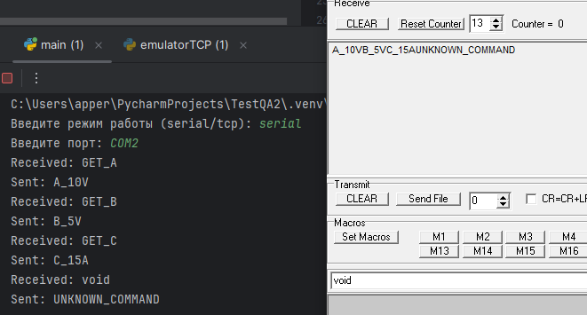

## Тестовое задание 2
### TCP emulator
Для тестирования программы был создан эмулятор TCP интерфейса. Он подключается к ip localhost порту 5000 и непрерывно отправляет следующие сообщения: 
GET_A GET_B GET_C void.
### COM emulator
Для тестирования программы не удалось создать эмулятор СOM интерфейса, поэтому было решено воспользоваться сторонним ПО. В программе com0com я создал два COM-порта связанных между собой.  
Для мониторинга сигнала я использовал Terminal by Bray. С помощью него можно как отправлять сообщения по COM-порту, так и отслеживать их. 

### Вывод
#### При использовании serial:
При помощи терминала отправляю сообщения: GET_A, GET_B, GET_C, void.

#### При использовании TCP:

